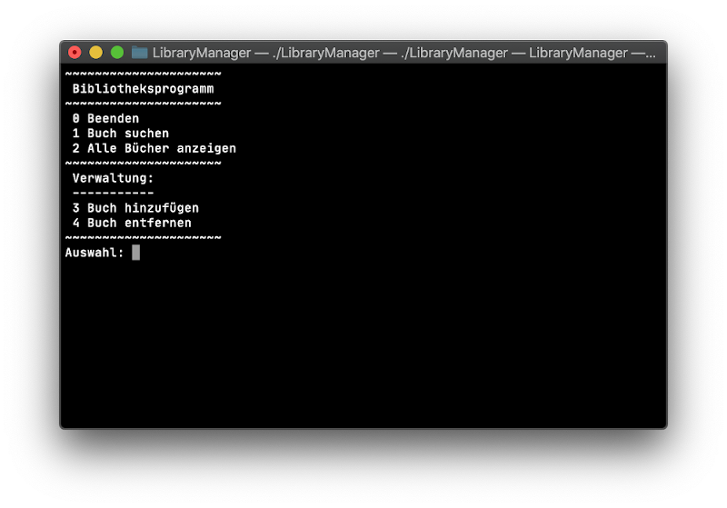
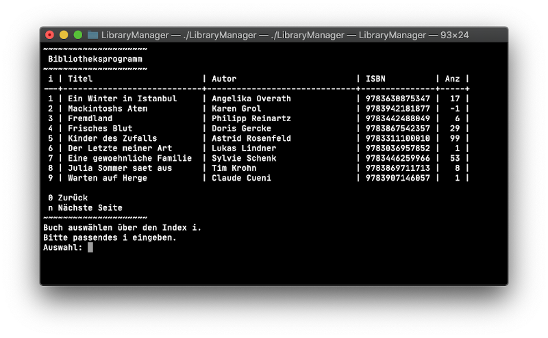

# DHBW.Bibliotheksprogramm

  

## Kompilieren und Ausführen
`gcc -Wall main.c searchUtils.c utils.c menus.c fileUtils.c programlogic.c dataStructure.c -o LibraryManager`  
`./LibraryManager`

## Aufgabenstellung  
C-Programm zur Verwaltung der Bücher einer Bibliothek.  
In einer Liste werden die Bücher erfasst. Folgende Daten sollen enthalten sein:  
- ISBN-Nummer
- Buchtitel
- Buchautor
- Anzahl der Exemplare
- Liste der Ausleiher

## Funktionalität
- [x] Bücher suchen und anzeigen
- [x] Buch ausleihen
- [x] Buch zurückgeben
- [x] Buch einfügen
- [x] Buch löschen

## Checkliste Implementierung
- [x] Leere Bücherliste erstellen, wenn Datei nicht existiert
- [x] Liste vor dem Beenden in Datei speichern
- [x] Prüfen der Gültigkeit der ISBN
- [x] Alle Bücher anzeigen

## Bedingungen
- Die Bearbeitung kann in Gruppen zu 2-3 Studierenden erfolgen. Alle Studierenden einer Gruppe erhalten die gleiche Bewertung.
- Das Programm muss mit dem GCC-Compiler kompilierbar sein. Es dürfen nur ANSI- kompatible Funktionen der Standard-Bibliothek verwendet werden.
- Abgabe: Source-Code als zip-File auf Moodle hochladen. Das zip-File mit den Namen der Gruppenmitglieder benennen. Abgabetermin ist 17.03.2019.

## Bewertungskriterien
| Kriterium | Punkte |
| ------------- | -----:|
| Funktionsumfang | 15 Punkte |
| Programmiertechniken | 10 Punkte |
| Benutzerinterface | 10 Punkte |
| Kompilierbarkeit und Robustheit | 10 Punkte |
| Strukturierung und Kommentierung | 5 Punkte |
